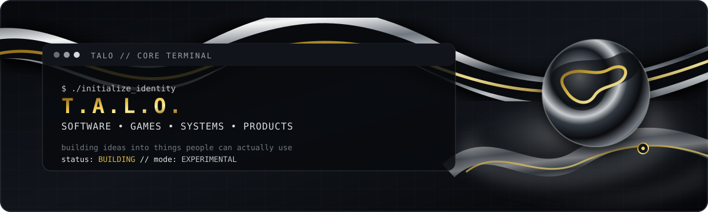

  
  
  
  

## ◈ ABOUT

> **Aspiring Computer Scientist · Game Developer · Failing Entepreneur**
>
> My interest in computer science has grown through my experience in making commercial products.
> I like working across software, game development, graphics, web technologies and systems — especially when a project forces me to learn something I don't already know.

`C++` `C#` `Python` `Rust` `TypeScript` `Godot` `Unity` `Blender` `Git`

## ◈ WHAT I'M BUILDING

<table>
<tr>
<td width="50%" valign="top">

### ⟡ GAME DEVELOPMENT

Designing worlds, mechanics and systems — from **2D/2.5D games** to larger experimental projects.

**Interests**
- Gameplay systems & combat
- Procedural generation
- Game architecture
- Graphics / rendering
- Multiplayer & networking
- Worldbuilding

</td>
<td width="50%" valign="top">

### ⟡ SOFTWARE

I enjoy moving between high-level applications and lower-level systems.

**Interests**
- C / C++ / Rust
- Web & backend development
- Databases
- APIs & networking
- Linux / tooling
- Performance & experimentation

</td>
</tr>
</table>

## ◈ TECH ARSENAL

### Languages

### Web · Data · Infrastructure

### Game · Graphics · Creative

### Systems · Hardware · Other

  Plus: TensorFlow · NumPy · Pandas · Matplotlib · scikit-learn · Cisco · Meta · OpenGL · Web3.js · Bevy · Epic Games · Steam · Xbox

## ◈ SELECTED INTERESTS

| AREA | CURRENT DIRECTION |
|:---|:---|
| **Game Development** | Gameplay systems, procedural worlds, combat, graphics |
| **Computer Science** | Software engineering, systems, algorithms, experimentation |
| **Graphics** | 2D/3D assets, rendering, shaders, interactive visuals |
| **Linux** | NixOS, desktop customization, Quickshell, developer tooling |
| **Entrepreneurship** | Building and experimenting with commercial products |

## ◈ GITHUB

 

## ◈ A FEW THINGS I LIKE

`LOW-LEVEL CODE`  ·  `GAME WORLDS`  ·  `LINUX`  ·  `3D ART`  ·  `OPEN SOURCE`  ·  `EXPERIMENTS`

  Designed around the T.A.L.O. visual identity — dark metal, graphite and gold.

