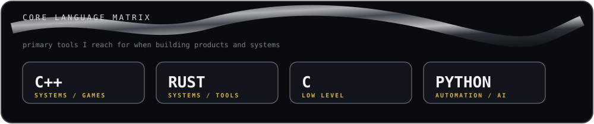

  
  
  
  

## ◈ ABOUT / IDENTITY

> **Aspiring Computer Scientist · Game Developer · Entrepreneur**
>
> My interest in computer science has grown through my experience in making commercial products. I enjoy taking an idea from **concept → engineering → prototype → product**, with games, software and experimental technology as my main playgrounds.

`PRODUCTS` · `SOFTWARE` · `GAME DEVELOPMENT` · `SYSTEMS` · `EXPERIMENTATION`

## ◈ WHAT I'M BUILDING

My technology company is the center of my work: a place to turn ideas into **software, games, tools and commercial experiments**. I use individual projects to explore the engineering needed to make those products real.

<table>
<tr>
<td width="55%" valign="top">

### ⟡ PRODUCT LAB

**Build → test → learn → iterate.**

I am interested in creating products rather than only collecting technologies. That means working across software architecture, interfaces, backend systems, graphics, game technology and the practical problems that appear when an idea becomes a real product.

</td>
<td width="45%" valign="top">

### ⟡ CURRENT DIRECTIONS

- Game & interactive software
- Developer / productivity tools
- Web & backend systems
- Graphics & real-time technology
- Experimental prototypes

</td>
</tr>
</table>

## ◈ CORE LANGUAGE MATRIX

## ◈ TECH ARSENAL

Rather than treating every tool as a separate identity, I group the stack around the kinds of products I build.

### SYSTEMS & CORE ENGINEERING

### WEB, BACKEND & DATA

### GAMES, GRAPHICS & CREATIVE TOOLS

### DATA, AI & EXPERIMENTATION

  Also exploring: R · Fortran · Dart · AssemblyScript · Web3.js · Bevy · OpenGL · NumPy · Pandas · Matplotlib · scikit-learn · Raspberry Pi · Cisco · NVIDIA

## ◈ SELECTED INTERESTS

<table>
<tr>
<td width="33%" valign="top"><b>GAME SYSTEMS</b> Gameplay architecture · procedural worlds · combat · networking · graphics</td>
<td width="33%" valign="top"><b>SOFTWARE ENGINEERING</b> Systems · APIs · databases · tooling · performance · architecture</td>
<td width="33%" valign="top"><b>COMPUTER GRAPHICS</b> Rendering · shaders · 2D/3D assets · interactive visuals</td>
</tr>
<tr>
<td valign="top"><b>LINUX & TOOLING</b> NixOS · Quickshell · desktop systems · developer workflows</td>
<td valign="top"><b>PRODUCT ENGINEERING</b> Prototyping · iteration · UX · shipping · commercial software</td>
<td valign="top"><b>EXPERIMENTATION</b> Trying unfamiliar technologies to solve concrete problems</td>
</tr>
</table>

## ◈ GITHUB TELEMETRY

> **Note:** I intentionally replaced the generic “Most Used Languages” card with a custom **Core Language Matrix**. GitHub's language card measures repository file composition, which can be misleading for a profile README and can show something like `HTML 100%` even when that isn't representative of the languages you actually work with.

  T.A.L.O. // graphite terminal × liquid metal × gold signal

